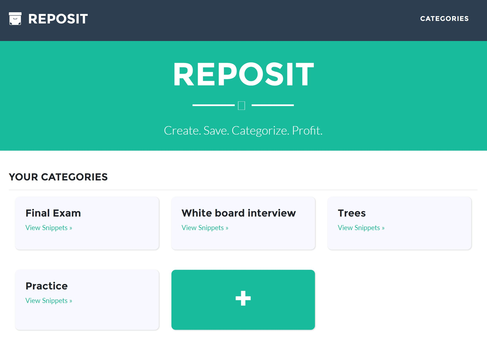
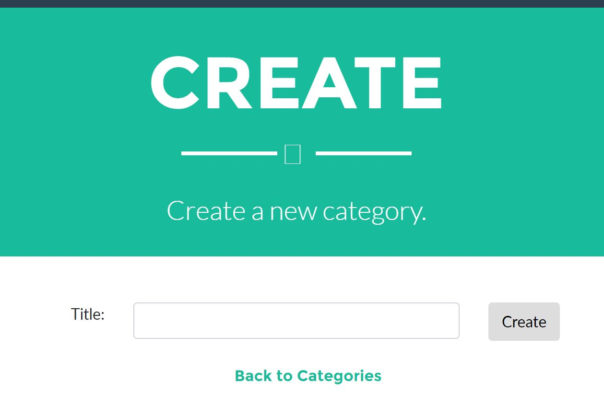
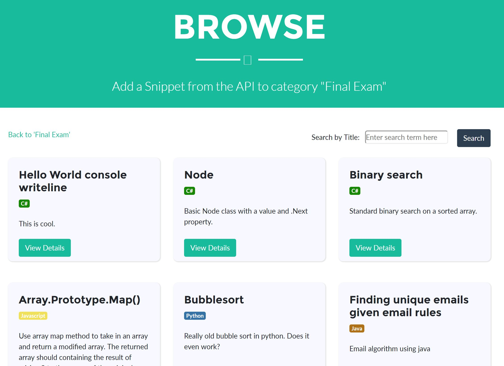
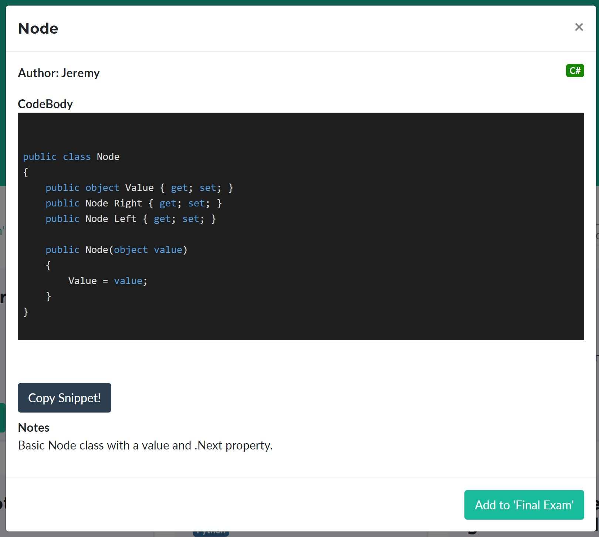
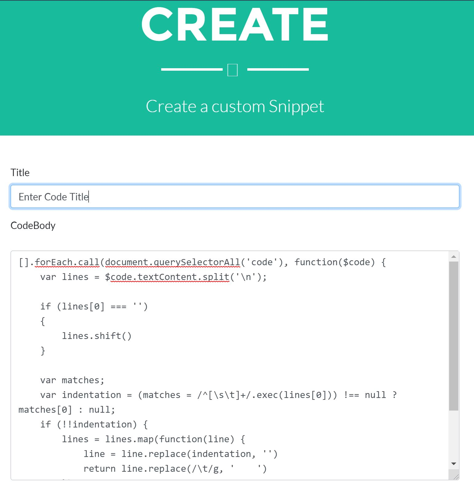
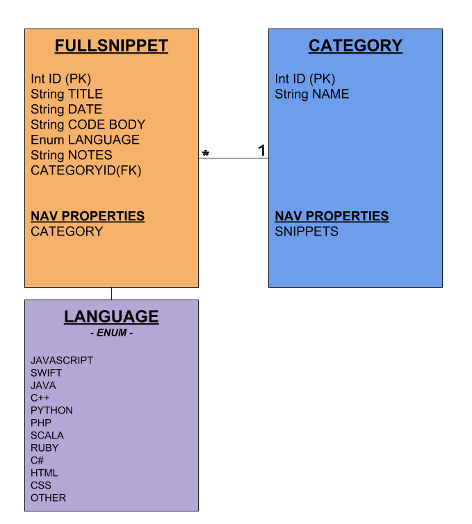

# Reposit
A simple code snippet repository where you can create and categorize helpful code snippets for reuse or review in the future.

Reposit helps you keep track of concise solutions to frequently-encountered problems so that you can quickly retrieve them in the future.

The project comprises the RepositAPI and the Reposit Web Application, which are "standalaone" services hosted separately, though the Reposit Web Application makes calls to the RepositAPI.

[RepositAPI Docs](/RepositAPI/README.md)

## Planning
[Project Plan](/documents/Project-Plan.md)

## Deployed Site
https://reposit.azurewebsites.net/ (no longer hosted)

## Usage
Reposit UI is easy to use and navigate. For example, the picture below shows the home page for a logged-in user listing all categories the user's created.

Clicking on Create or the empty card lets you create a new category. A category is what Reposit uses to categorize and store code snippets.

Clicking on a category name takes you to a list of all snippets stored to that category.

Clicking on Browse will show all snippets from our API.

Clicking on Show Details opens a popup wizard that walks you through adding a snippet to a category.

From the Category Details view, you can also create a new snippet with custom code. 

## Database Schema

## Tools used
Visual Studio, .NET MVC CORE, Entity Framework, CSS/HTML, SQL database, Azure, HighlightJS

## Contributors
* Jeremy Beck (mtncrawler)
* Kendra Ellis (ellisken)
* Allisa LeBeuf (allisa)
* Richard Jimenez (richjimdev)
* Jeff Weng (inkh)

## License
MIT
