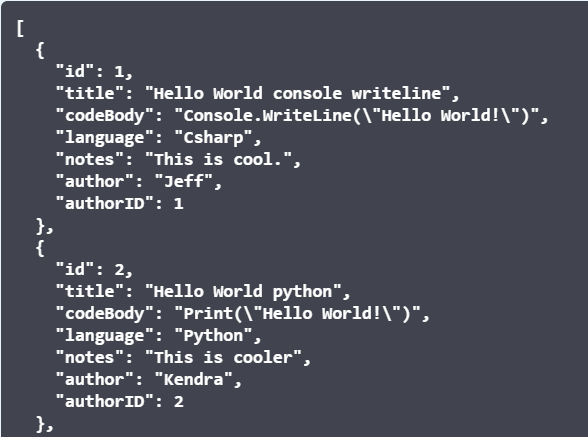

# RepositAPI
The RepositAPI serves a list of code snippets from the RepositAPI database via GET request. It also supports POST requests
for creating new Snippet and Author entities. 

For more info, please visit the [swagger documentation](). **NOTE - this documentation is no longer accessible because we no longer maintain or host Reposit**

## Main Endpoint
https://repositapi.azurewebsites.net/api

## Documentation
[RepositAPI Documentation](https://repositapi.azurewebsites.net/swagger)

## Usage
Example GET request to retieve all snippets:

1. Send a GET request to https://repositapi.azurewebsites.net/api/snippet via Postman or use the following CURL command ```curl -X GET "https://repositapi.azurewebsites.net/api/Snippet" -H "accept: text/plain"```
2. You'll receive a response like the following partial list:
	

## Database Schema


*Description* 
* Snippet: This table holds the data for each individual snippet, such as the Title, Code Body, Notes, Author, and Language. This table also features an Enum for code languages.
* Author: This table holds the data for each individual author.

## Tools used
Visual Studio, .NET MVC Core, Entity Framework, Swagger, Azure

## Contributors
* Kendra Ellis (ellisken)
* Jeff Weng (inkh)

## License
MIT
