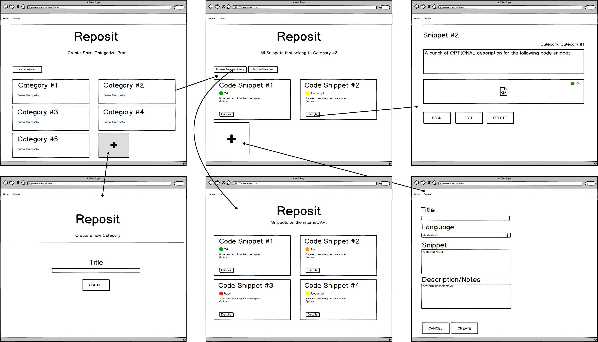
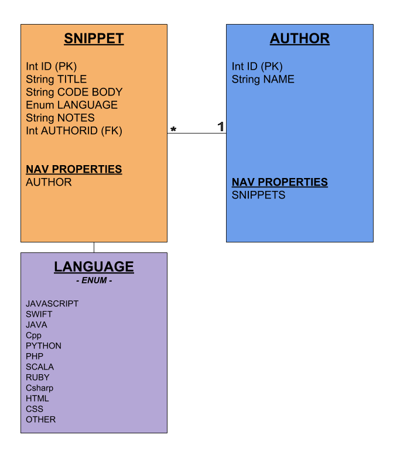

# Project Plan

## Contents
1. [Vision](#vision)
2. [Scope](#scope)
3. [Requirements](#requirements)
4. [User Stories](#user-stories)
5. [Wireframes](#wireframes)
6. [Dataflow Diagram](#dataflow-diagram)
7. [Database Schemas](#database-schema)

## Vision
This product will provide a virtual repository that allows users to create 
and categorize snippets that they find helpful. 
This helps users to keep track of important and helpful solutions to problems they may encounter frequently. 
For example, a user may want to remember how they effectively processed an array of integers and removed all multiples of 5. 

## Scope
* IN:
  - The web app will allow users to save snippets of code.
  - The web app will allow users to save snippets by code language.
  - We will allow users to associate snippets with category "sets" such as "Final Exam" or "Data Structures."
  - Each snippet will require a user to add the snippet’s source upon creation.
  - We will allow users to add new snippets to a Category set via browsing all of their snippets and all snippets retrieved from the RepositAPI.

* OUT:
  - We will not allow users to save any other type of data besides text.
  - We will not be creating a mobile app version of this app.
  - We will not require developers to use an API key to acquire or use our API.
  - We will not require users to create accounts with logins.
  
### MVP
A user can create, edit, and delete a category and will have the ability to add snippets to the category by either creating a new snippet or adding a snippet from the RepositAPI.

### Stretch
  - The website will create a new endpoint for unique users so that individual snippet repositories are accessible by a unique URL.
  - The user will see a list of suggested “study decks” on their homepage for quick access to particular decks.
  - The website will be mobile-friendly (responsive)
  

## Requirements
### Functional Requirements
 - The user can add, edit, and delete code snippets.
 - The user can add, edit, and delete category sets for snippets.
 - The web app will display code snippets and details. 
 - The web app will have create, update, and delete views.
### Non-Functional Requirements
* Usability
  - Intuitive Design: The UI will be designed in a way where users do not have to rely on external or extra instructions to use the web app.
  - Clean & Concise: The UI will be uncluttered and easy to follow and understand.
* Testability
  - Unit Tests: CRUD Operations 
  - The site will have a small total number of user “paths” (associated with CRUD operations) which makes it easier to test that each user path works as intended.
  - Unit Tests: Routes, Controllers & Views
  
## User Stories
### Web App  
* SEARCH: As a user, I want to search for code snippets to add to different code snippet categories.
  - Features
    - User can search by title for code snippets
    - Display search results
    - Ability to get more details and add to category
  - Acceptance
    - Ensure the search terms retrieve the correct data
    - Snippet is added to category
* DESIGN: As a user, I want a clean design and intuitive navigation for good user experience.
  - Features
    - User can clearly navigate  
    - Navigation menu present on all views  
  - Acceptance
    - Hallway testing
* VIEW: As a user, I want to view code snippets and details on a page so I can review all the useful code snippets in a specific Category.
  - Features
    - Code snippet listed on a page  
	- Details link for each code snippet  
    - Organized and ease of reading  
  - Acceptance
    - Code snippets in category rendered on category index page  
    - Details link displays all details  
* ADD: As a user, I want to add code snippets and details to a category.
  - Features
    - Forms for user to input all details and code  
    - Language drop down menu 
  - Acceptance
    - All details are saved   
	- Code snippet details link displays details  
* MANAGE: As a user, I want to manage code snippets in a category.  
  -Features
	- Add, update and delete code snippets from category  
	- View details of code snippets  
	- Browse new code snippets to add to category
  - Acceptance
    - Code snippets are added, updated, or deleted   
	- Details accessable from category page    

### API  
* CREATE: As a user, I want to to add code snippets to a category from the API results.
  - Features
    - User selects a code snippet to display details
    - Add to category option in the details of code snippet
    - Only code snippets not in the category are available to add to category
  - Acceptance
    - API code snippet is added to category
    - Code snippets already in the category are not displayed 
* READ: As a user, I want to retrieve code snippets from the API.
  - Features
    - User can access browse page from a category to view API code snippets and web code snippets not within the category  
    - API code snippets will match the formatting of web app code snippet details
    - Details can be displayed for API code snippets before adding  
	- User can add API code snippet to category  
  - Acceptance
    - API code snippets displayed on broswe page 
    - Code snippet is added to category  
    - All details transferred from API  
* TRANSFER: As a developer, I want model properties to match to the web models to ease transfer of data.
  - Features
    - Model properties for snippet objects match or are similiar  
    - Transmit all details for code snippets to web app  
  - Acceptance
    - Unserialized data matches expected API code snippet details 
    - Data is transmitted to web app 
* DELETE: As a developer, I want to create endpoint documentation and method comments for easy to read code.
  - Features
    - Utilize swagger for endpoint and API documentation  
	- Add comments to API methods  
  - Acceptance
    - Pass tests for API endpoints
    - Swagger grabs method comments  

## Wireframes

## Dataflow Diagram

## Database Schema
### API DB Schema

*Description* 
* Snippet: This table holds the data for each individual snippet, such as the Title, Code Body, Notes, Author, and Language. This table also features an Enum for code languages.
* Author: This table holds the data for each individual author.

### Web App DB Schema

*Description*
* FullSnippet: This table will hold the data for each individual snippet, such as the name, date, and code snippet body of text. This table also features an Enum for code languages.
* Category: This table contains the categories that group FullSnippets.
